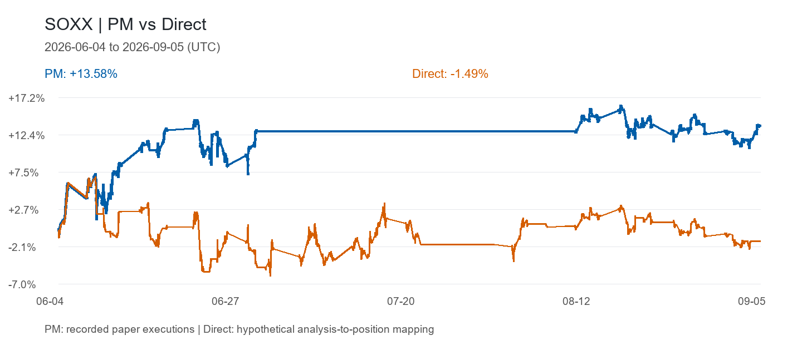
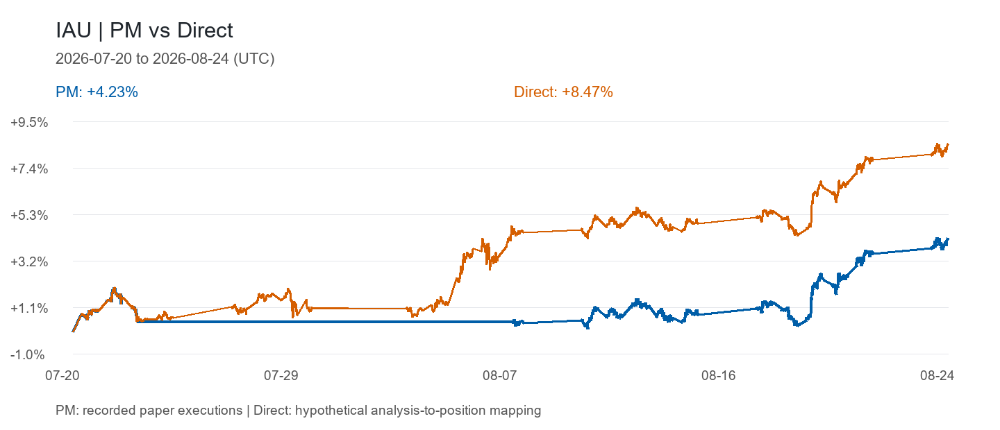
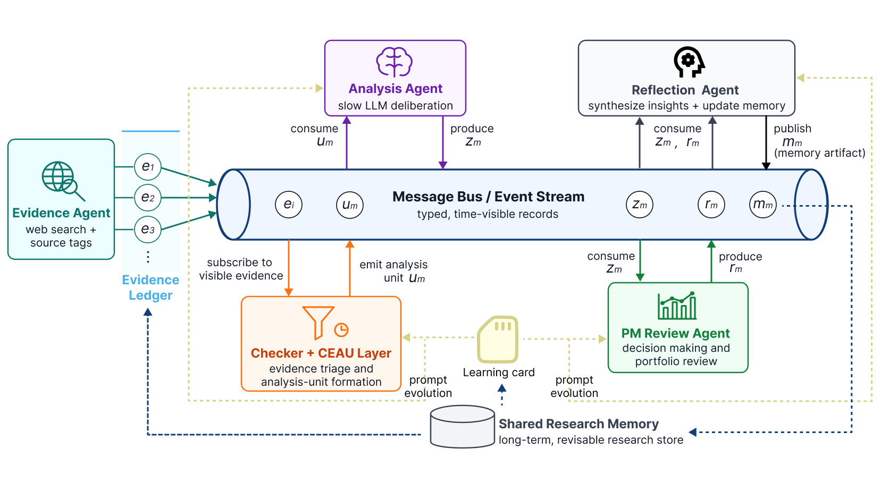

# Event-Trader: An Event-Driven LLM Research Runtime for Asynchronous Financial Evidence

[Paper](paper/event_trader.pdf) · [Results](#results) · [Installation](#installation) · [Usage](#usage) · [Experiments](#experiments) · [Citation](#citation)

Event-Trader follows incoming financial evidence to update research and trading decisions. It models a discretionary trading workflow: admit new evidence, decide when further research is needed, revise research memory, and review positions. The paper evaluates this event-driven LLM system in a gold-trading application.

## Results





| Paper-trading case (2026, UTC) | PM | Direct |
| --- | ---: | ---: |
| SOXX, June 4–September 5 | **+13.58%** | −1.49% |
| IAU, July 20–August 24 | +4.23% | **+8.47%** |
| BTC, September 11–15 (full available overlap) | −0.81% | +1.14% |

PM follows recorded paper executions with their persisted execution-adjusted costs. Direct is a hypothetical mapping of analysis assessments to positions. SOXX's cutoff and IAU's 35-day interval were selected after observing performance; [full intervals, CSVs and original PM Console instructions](data/paper-trading/README.md) accompany these cases. BTC currently has less than 30 days of overlapping price coverage. These examples are separate from the paper's historical replay experiments.

See the [paper](paper/event_trader.pdf) for the full comparisons and experimental setup, and [REPRODUCTION.md](REPRODUCTION.md) for saved results and reproduction details.

## Framework



- **Evidence admission** records source information and visibility timestamps for replay.
- **Checker and CEAU** assess relevance and form bounded analysis units from incoming evidence.
- **Analysis** investigates these units and updates revisable research memory.
- **PM review** turns research updates into position decisions and simulated execution.
- **Reflection** synthesizes outcomes into shared research memory for subsequent decisions.

## Installation

Use Python 3.13+ and [uv](https://docs.astral.sh/uv/). The core installation and CLI have been checked on Windows; full agent runs also need the separate MiroThinker environment and model credentials.

```sh
git clone https://github.com/WAI0258/EventTrader.git
cd EventTrader/code
uv sync --frozen --no-dev
uv run event-trader --help
```

The MiroThinker runtime source is included under `code/vendor/mirothinker/`. Its separate environment can be installed from `code/` with:

```sh
uv sync --project vendor/mirothinker/apps/miroflow-agent --frozen --no-dev
```

Full model-runtime installation has not yet been validated. See [the reproduction guide](REPRODUCTION.md) for environment and historical-run limitations.

### Configuration

The gold replay configuration is [`code/config/kernel.replay.gold.toml`](code/config/kernel.replay.gold.toml). It specifies the model provider, research agents, replay inputs, workspace and simulated execution settings.

The included configuration uses `MINIMAX_API_KEY`. Set it in the shell that launches the replay:

```sh
export MINIMAX_API_KEY="your-key"
```

In PowerShell:

```powershell
$env:MINIMAX_API_KEY = "your-key"
```

Additional tool credentials depend on the tools you enable; variable names are listed in [`code/.env.example`](code/.env.example). Market bars and timestamped evidence must be obtained separately. The repository does not redistribute original paid-provider inputs.

## Usage

### Inspect the paper-trading examples

The original PM Console includes a saved-result mode for inspecting the supplied numerical workspaces without raw market data or API credentials:

```sh
cd code
uv run event-trader-pm-console --mount-catalog ../data/paper-trading/mounts.toml --saved-results
```

In another terminal, run `npm ci` and `npm run dev` from `code/frontend/pm-console/`, then open http://127.0.0.1:4173. Select a target to inspect its PM/Direct curves and recorded position decisions. See the [example guide](data/paper-trading/README.md) for the retained data and omitted narrative content.

Users can also connect their own Futu or compatible market-data provider and add a Buy & Hold baseline over the same historical interval. See [the baseline instructions](data/paper-trading/README.md#compare-with-buy--hold-using-your-own-market-data); fetched data stays local, and saved PM/Direct results remain unchanged.

### Replay

From `code/`, inspect the replay options:

```sh
uv run python -m event_trader.tools.replay_runtime run --help
```

After preparing the market archives and evidence dataset required by the configuration, a gold replay uses:

```sh
uv run python -m event_trader.tools.replay_runtime run \
  --config config/kernel.replay.gold.toml \
  --dataset /path/to/evidence.jsonl \
  --target-key gold \
  --window-start 2026-01-01 \
  --window-end 2026-06-30 \
  --run-id gold-replay
```

This is a command template, not a bundled complete experiment. Use a separate output workspace for new runs. Details on input formats, baseline setup and evaluation are in [REPRODUCTION.md](REPRODUCTION.md).

## Experiments

In a one-week ablation (February 24–March 2, 2026), Continuous Event-to-Analysis Unit (CEAU) formation reduced total successful analysis runtime by **64.2%** and successful token use by **62.9%** relative to direct per-record invocation. Returns were 1.53% and 1.44%, respectively; direct per-record invocation had the lower maximum drawdown (0.27% versus 0.48%).

The repository includes saved baseline comparisons, timebatch experiments, CEAU ablation records and case-study summaries. Check these results without model calls or API keys, from the repository root:

```sh
python -B tools/verify_results.py
python -B tools/plot_saved_results.py
```

Plots are written to `generated/`. These commands check saved results and do not rerun the agents. Exact per-run source/configuration equivalence and complete historical reruns remain unverified; the guide records these limits.

| Directory | Contents |
| --- | --- |
| `code/` | Runtime, configuration and MiroThinker dependency |
| `baselines/` | Baseline adapters, evaluation and saved results |
| `experiments/` | Timebatch, ablation and case-study artifacts |
| `tools/` | Offline verification and plotting |
| `data/` | Input schemas and metadata |
| `paper/` | Manuscript PDF |

## Citation

```bibtex
@unpublished{cai2026eventtrader,
  title = {Event-Trader: An Event-Driven LLM Research Runtime for Asynchronous Financial Evidence},
  author = {Cai, Jia Wei},
  year = {2026},
  note = {Manuscript},
  url = {https://github.com/WAI0258/EventTrader}
}
```

## License

Original software is licensed under [Apache-2.0](LICENSE). Third-party code retains its [upstream licenses](THIRD_PARTY_NOTICES.md). The manuscript and data/results are outside the software license.
