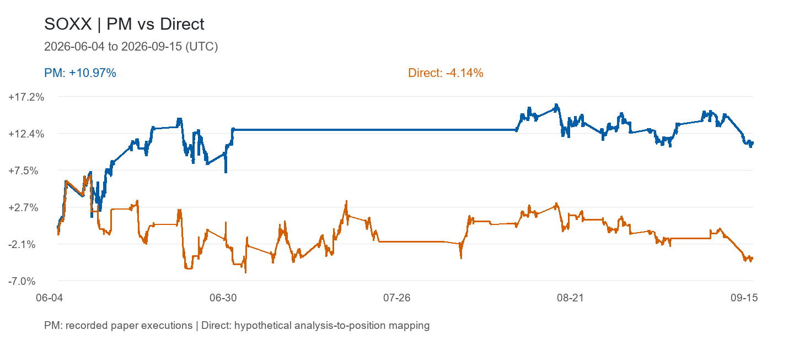
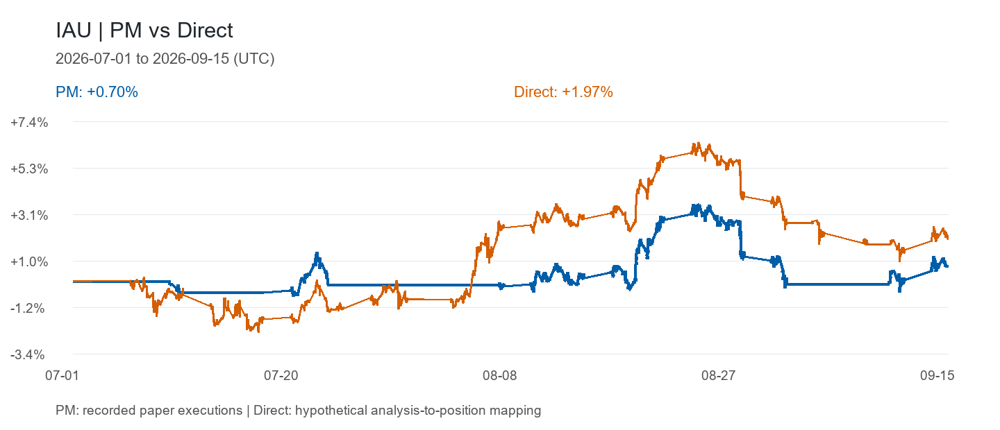
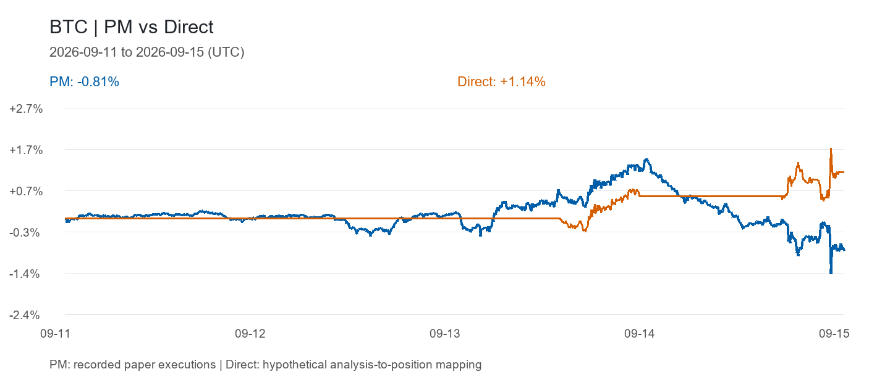

# Paper-trading examples

These are recorded paper-trading operations and saved PM Console results, not funded brokerage account returns. PM uses persisted execution-adjusted prices, including the costs recorded by the execution engine. Direct is the counterfactual analysis-to-position mapping.

| Case | Interval (UTC) | PM | Direct |
| --- | --- | ---: | ---: |
| SOXX selected | June 4–September 5, 2026 | +13.58% | −1.49% |
| SOXX full available example | June 4–September 15, 2026 | +10.97% | −4.14% |
| IAU selected | July 20–August 24, 2026 | +4.23% | +8.47% |
| IAU full available example | July 1–September 15, 2026 | +0.70% | +1.97% |
| BTC full available example | September 11–15, 2026 | −0.81% | +1.14% |

SOXX's selected cutoff was chosen after observing its performance. The IAU case maximizes observed PM return among daily endpoints separated by at least 30 calendar days (35 days selected). All selected curves share the same endpoints and retain preceding position history. Full examples and CSVs accompany the selections. BTC has fewer than 30 days of available overlapping prices, so no selected 30-day case is provided.

## Original PM Console

From the repository root:

```sh
cd code
uv sync --frozen --no-dev
uv run event-trader-pm-console --mount-catalog ../data/paper-trading/mounts.toml --saved-results
```

In another terminal:

```sh
cd code/frontend/pm-console
npm ci
npm run dev
```

Open http://127.0.0.1:4173 and choose SOXX, gold (IAU), or BTC in the target sidebar. The saved-result mode uses the original Console interface and reads the workspace's `runtime/pm_console/<target>.position.json`. It loads no raw market bars, makes no model calls, and rejects write requests. No API credentials or Futu OpenD are needed for these sample views.

The accompanying workspaces preserve numerical assessment/decision/execution records, timestamps and cost fields. Receipt identifiers containing local filesystem paths are replaced with stable sample identifiers. Narrative research text is omitted and explicitly marked as omitted. Numerical episode artifacts are rebuilt from the retained canonical state changes; thesis prose is not included. Files are examples for inspection, not resumable live trading workspaces.

Raw provider OHLCV history, private operator notes, source news bodies, account information and local caches are excluded. Saved curves cover fixed historical intervals; they do not assert current market-data coverage or availability. The Console retains recorded linkage warnings where present.

Timestamp provenance: 14 of the 22 retained executed SOXX records were persisted more than one hour after their recorded execution timestamps. The IAU source workspace includes catchup processing. Curves use the persisted execution timestamps and market valuation series; the samples do not establish that every analysis and operation was recorded contemporaneously.

## Compare with Buy & Hold using your own market data

The optional baseline uses your configured provider to fetch the exact full sample interval. It adds Buy & Hold to the existing Console chart without recalculating or overwriting the saved PM/Direct curves. It applies one configured buy-side entry cost, using the original Console performance calculator. No market data is fetched during ordinary saved-result viewing.

For SOXX and IAU, install the existing optional Futu dependency (`uv sync --frozen --no-dev --extra futu`) and run your own authenticated Futu OpenD. The sample configurations use `tcp://127.0.0.1:11111`; change this connection in `config/kernel.console.soxx.toml` and `config/kernel.console.iau.toml` if needed. Historical K-line access depends on your account permissions and quota: see [Futu's historical K-line documentation](https://openapi.futunn.com/futu-api-doc/en/quote/request-history-kline.html).

From `code/`, generate the baselines you want:

```sh
uv run python -m event_trader.tools.pm_console_buy_hold --config config/kernel.console.soxx.toml --target sox
uv run python -m event_trader.tools.pm_console_buy_hold --config config/kernel.console.iau.toml --target gold
uv run python -m event_trader.tools.pm_console_buy_hold --config config/kernel.console.btc.toml --target btc
```

Then start the API with the local baseline directory:

```sh
uv run event-trader-pm-console --mount-catalog ../data/paper-trading/mounts.toml --saved-results --buy-hold-results-dir .local/buy-hold
```

Start the same frontend as above. Targets with a generated baseline display all three curves; other targets retain PM/Direct only. The generated files stay in the Git-ignored `code/.local/buy-hold/` directory. They contain normalized Buy & Hold results, the provider name, entry cost and a hash binding them to the saved sample; the command does not save raw OHLCV bars or credentials. Refresh a baseline by rerunning its command.

Keep the instrument, UTC interval, 5-minute bars, raw-price convention and extended equity session consistent. Incomplete or mismatched bar boundaries are rejected instead of silently shortening the comparison or filling missing prices. A stale overlay is rejected if the saved sample changes. Prices from another provider may differ from those used in the saved PM/Direct valuation; the Console labels the baseline's provider. This is a price-return baseline with entry cost, not a dividend/funding-inclusive total-return calculation.

BTC in these samples is a Hyperliquid perpetual, and its example configuration uses `hyperliquid_perp`. Binance spot is supported elsewhere in the project but is not an equivalent baseline for this sample and is rejected here. If an API no longer supplies the full historical interval, use your own matching archive through the existing `local_archive` provider. Other APIs require a `MarketBarsProvider.read_series` adapter in `code/src/event_trader/market/provider.py`; this release does not claim arbitrary APIs work without an adapter.

Full-interval charts:




