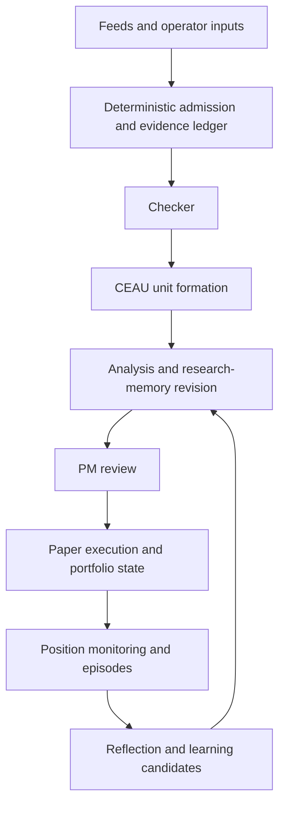

# Workflow and design principles

[Documentation index](../index.md) · [简体中文](../../zh-CN/concepts/workflow.md)

EventTrader models a discretionary trader who keeps a thesis, revises it when evidence changes, reviews actual exposure, and learns from outcomes. The workflow is organized around those business responsibilities.

## The main chain

This is a responsibility overview. Actual scheduling also includes time-driven reviews, queues, worker completion, and explicit operator commands.

## Why these boundaries matter

**Facts and cognition have different lifecycles.** Admitted evidence is append-only; research memory is revisable. A revised interpretation should not rewrite the evidence that originally supported it.

**Research and exposure are separate decisions.** Analysis evaluates evidence and thesis materiality without actual exposure. PM considers the portfolio, risk, and whether to hold or adjust. This makes a research change inspectable even when no trade follows.

**Transport does not own reasoning.** Admission, clocks, bus messages, and execution arithmetic are deterministic. Agents own interpretation and synthesis within validated contracts. MiroThinker/MiroFlow and NautilusTrader supply infrastructure or runtime support; project modules retain business ownership.

**Memory survives one invocation.** Markdown pages, citations, thesis revisions, and episode records connect research over time. “Memory” here is not a disposable response cache.

## Following one event

Trace its source identity and admitted ID into a Checker receipt, a CEAU unit when configured, the Analysis outcome, any PM request/decision, and the execution result. The final step may be no material update, no PM review, hold, deferred execution, or an operation. Those are meaningful outcomes.

The design supports investigation and controlled evolution. It does not by itself establish better returns, universal exactly-once processing, or a complete transaction across all files.

## Inputs, outputs, and owners

| Boundary | Input | Accepted output / owner |
| --- | --- | --- |
| Admission | Validated feed payload and source metadata | Evidence ID/ledger record; deterministic infrastructure |
| Checker | Evidence plus bounded research context | Recorded gate decision; validated agent-assisted policy |
| CEAU | Routing input, policy and time/completeness observations | Analysis unit and lifecycle records; deterministic coordination |
| Analysis | Decision-visible evidence/context and governed tools | Assessment/no-material outcome and research revisions; Analysis owner |
| PM | Review reason, research, actual exposure and risk | PM decision; portfolio reasoning with deterministic checks |
| Execution | Accepted PM decision, bars and cost policy | Intent/result and executed state transition; paper engine |
| Reflection | Eligible episode, decision/execution evidence and outcomes | Review and explicit experience actions; validated reflection lifecycle |

Operator context is an additional input with its own history. It can inform research without replacing acquired evidence or executed state.

## An illustrative event sequence

A new report arrives for a target with an existing thesis. Admission records its provenance; Checker can decide that deeper research is warranted. Under the selected CEAU lane, it can join related context or interrupt waiting. Analysis then reads only the necessary evidence/memory/market detail and decides whether the thesis materially changed.

A change can prompt PM without dictating its action. PM may retain the current exposure or produce an adjustment. Only an executed paper result updates the position transition. Later monitoring/reflection uses the linked episode and available outcomes.

This sequence explains the design; it is not a reconstructed SOXX/IAU/BTC trade. Use each asset's recorded report for an actual operational timeline.

## Implementation

- [code/src/event_trader/composition.py](../../../code/src/event_trader/composition.py)
- [code/src/event_trader/runtime/research_pipeline.py](../../../code/src/event_trader/runtime/research_pipeline.py)
- [code/src/event_trader/runtime/graph.py](../../../code/src/event_trader/runtime/graph.py)
- [code/src/event_trader/storage/layout.py](../../../code/src/event_trader/storage/layout.py)

[Documentation index](../index.md) · [简体中文](../../zh-CN/concepts/workflow.md)
