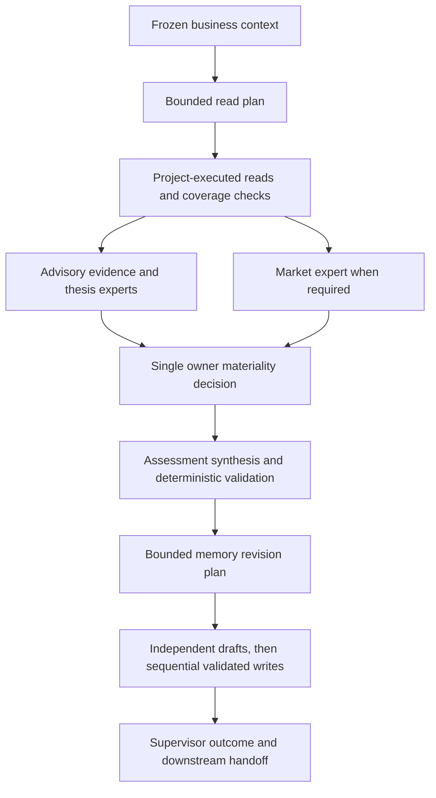

# Agent harness and controlled execution

[Documentation index](../index.md) · [简体中文](../../zh-CN/development/agent-harness.md)

The harness is the project-owned execution around reasoning: context preparation, stage sequencing, tool permissions, budgets, validation, repair, and persistence. It is more than a system prompt and less than a claim of autonomous correctness.

## Analysis stages

No-material and failure exits branch from this flow. Experts do not acquire write authority, and an owner decision stage cannot freely call tools.

## Limits and parallelism

The current Analysis workflow permits 16 read calls and 12 planned write calls. Up to 3 independent revision writers draft concurrently; staged writes are validated/applied sequentially, with canonical application handled separately by the supervisor. This is different from the runtime's worker-concurrency configuration.

Prompt/context/output budgets are checked around structured stages. Optional expert selection is deterministic; it is not an unbounded debate loop.

The implementation separates transport attempts (up to 5), structured-protocol attempts (up to 3), and finite business repair. Those limits belong to the current structured Analysis implementation, not every external agent.

## Accepted output and recovery

Validation feedback is fed back into bounded regeneration. Activity receipts and stage traces preserve accepted/rejected status, timings and available usage metadata. Token reporting depends on provider accounting; stage time is not full system latency.

Staging reduces uncontrolled canonical writes, but supervisor persistence still spans separate memory, assessment, thesis, outcome, PM and episode artifacts. It is not globally atomic.

## Related harnesses

PM has bounded supplemental reads and a final decision/risk contract. Reflection has eligibility, outcome context and learning-write contracts. Search integration has separate acquisition/provenance responsibilities; it should not be described as identical to the structured Analysis path.

Read [agent contracts](agent-contracts.md), [runtime/state](runtime-and-state.md), and [temporal visibility](../concepts/temporal-visibility.md) together when changing a stage or tool.

## Stage ownership in practice

| Stage | Can choose | Cannot do |
| --- | --- | --- |
| Read planner | Ordered reads within the remaining budget | Make the materiality decision or write research |
| Advisory experts | Evidence/thesis/market interpretations | Commit, vote the owner out, or set portfolio exposure |
| Analysis owner | Emit/no-material decision and rationale | Freely call tools or produce actual position actions |
| Assessment synthesis | Contract-constrained assessment draft | Invent runtime-owned identity or bypass validation |
| Revision planner | Valid operation/page/section intents | Draft Markdown or change the accepted assessment |
| Revision writer | Body for its selected intent | Retarget the write or change unrelated sections |
| Supervisor | Validate and apply accepted artifacts/handoffs | Convert a rejected model answer into a successful outcome without a recorded path |

This ownership is encoded in stage prompts, schema selection, tool execution, and project validation. A prompt restriction without an enforced tool boundary should not be credited as the same protection.

## Repairs stay local to their failure

A read-coverage gap asks for additional reads without rerunning downstream stages. Owner reconsideration explicitly revisits rejected definite expert advice. Assessment repair uses deterministic field feedback. Revision-plan/writer repair accumulates violations and preserves the accepted decision.

Separating these paths avoids discarding valid earlier work each time one output field fails. It also avoids giving a writer permission to change the original research judgment as compensation for a write error.

Transport, protocol, and business attempts can multiply. Read/write limits are not the total number of model calls or a dollar budget. A zero configured wall-clock timeout is allowed; inspect timeout settings before treating a run as time-bounded.

## Temporary versus durable traces

Task staging and its tool activity are temporary. Workflow diagnostic traces go to the configured log path; canonical write attribution and Analysis outcome records provide separate durable links. Outcomes are partitioned as `runtime/analysis_outcomes/<target>/YYYY-MM.jsonl`.

Preserve both accepted output and diagnostic references when investigating a failure. A path in a receipt may identify a temporary artifact that has already been removed; its existence is not guaranteed forever.

## Implementation

- [code/src/event_trader/reasoning/analysis_workflow.py](../../../code/src/event_trader/reasoning/analysis_workflow.py)
- [code/src/event_trader/reasoning/analysis_supervisor.py](../../../code/src/event_trader/reasoning/analysis_supervisor.py)
- [code/src/event_trader/reasoning/anthropic_structured.py](../../../code/src/event_trader/reasoning/anthropic_structured.py)
- [code/src/event_trader/pm_review/workflow.py](../../../code/src/event_trader/pm_review/workflow.py)
- [code/src/event_trader/reflection/workflow.py](../../../code/src/event_trader/reflection/workflow.py)

[Documentation index](../index.md) · [简体中文](../../zh-CN/development/agent-harness.md)
