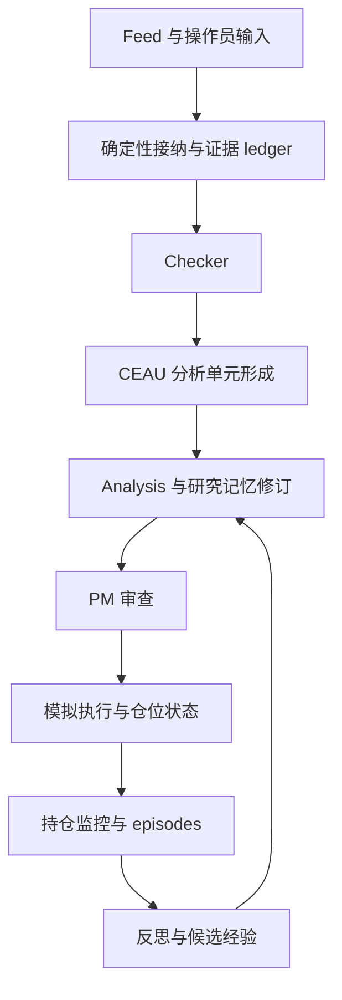

# 工作流程与设计理念

[文档目录](../index.md) · [English](../../en/concepts/workflow.md)

EventTrader 模拟有纪律的主观交易者：维护 thesis，在新证据下修订判断，结合实际敞口审查仓位，并从结果中复盘。模块围绕这些业务职责划分。

## 主要链路

这是职责图。实际调度还包含按时间触发的审查、队列、worker completion 和显式操作员命令。

## 为什么这样划分

**事实与认知生命周期不同。** 接纳证据采用 append-only，研究记忆允许修订。解释变化不应覆盖当初支持它的证据。

**研究与敞口是两个决策。** Analysis 不接触实际敞口，判断证据和 thesis 是否发生实质变化；PM 再结合仓位与风险决定 hold 或调整。因此没有交易时，研究变化仍可单独审查。

**传输不负责推理。** Admission、时钟、bus 消息和执行算术属于确定性层；agent 在受校验契约内负责解释和综合。MiroThinker／MiroFlow 与 NautilusTrader 提供运行时或基础设施支持，业务所有权仍在项目模块。

**记忆跨调用持续存在。** Markdown 页面、引用、thesis 版本和 episode 记录串联研究，不是一次性回复缓存。

## 追踪一条事件

从来源身份、admitted ID 跟到 Checker 回执、配置下的 CEAU unit、Analysis outcome、可能的 PM 请求／决策及执行结果。最终可能是无实质更新、不召集 PM、hold、延迟执行或操作，这些都是有效业务结果。

这种设计支持排查与渐进演进，但本身不能证明收益提升、全局 exactly-once 或全部文件的事务性。

## 输入、输出与所有者

| 边界 | 输入 | 接受的输出／所有者 |
| --- | --- | --- |
| Admission | 经校验 feed payload 与来源元数据 | Evidence ID／ledger record，确定性基础设施 |
| Checker | 证据与有边界研究上下文 | Gate 决策记录，经校验 agent-assisted policy |
| CEAU | Routing input、policy、时间／完整性观测 | Analysis unit 与 lifecycle，确定性协调 |
| Analysis | 决策可见证据／context 与受控工具 | Assessment／no-material 和研究修订，Analysis owner |
| PM | Review reason、研究、实际敞口和风险 | PM 决策，仓位推理与确定性校验 |
| Execution | 接受的 PM 决策、bar 和成本策略 | Intent／result 与已执行状态转换，paper engine |
| Reflection | 合格 episode、决策／执行证据和结果 | Review 与明确经验动作，经校验反思生命周期 |

Operator context 是附加输入，有独立历史，可以影响研究，但不能替代采集证据或执行状态。

## 一条示例事件链

一个已有 thesis 的目标收到新报告，admission 记录 provenance，Checker 可以决定深入研究。依据 CEAU lane，它可能加入相关 context，或打断等待。Analysis 只深读必要的 evidence／memory／market 细节，再判断是否实质变化。

变化可以召集 PM，但不指定动作。PM 可能保留敞口或给出调整，只有 executed paper result 才更新仓位转换。后续 monitoring／reflection 使用关联 episode 和可用结果。

这是设计示例，不是重建 SOXX／IAU／BTC 某笔交易；真实操作时间线请看对应标的报告。

## 实现依据

- [code/src/event_trader/composition.py](../../../code/src/event_trader/composition.py)
- [code/src/event_trader/runtime/research_pipeline.py](../../../code/src/event_trader/runtime/research_pipeline.py)
- [code/src/event_trader/runtime/graph.py](../../../code/src/event_trader/runtime/graph.py)
- [code/src/event_trader/storage/layout.py](../../../code/src/event_trader/storage/layout.py)

[文档目录](../index.md) · [English](../../en/concepts/workflow.md)
