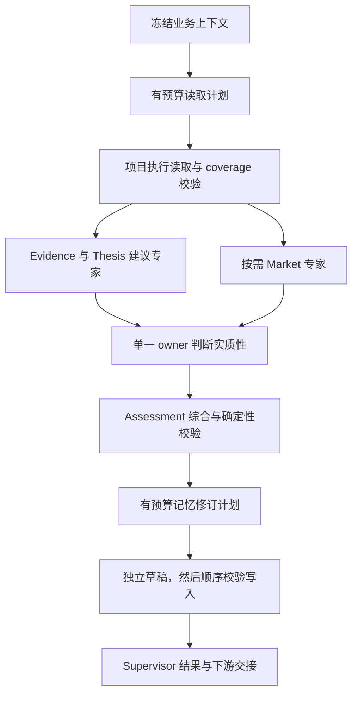

# Agent Harness 与受控执行

[文档目录](../index.md) · [English](../../en/development/agent-harness.md)

Harness 是推理外围的项目执行层：上下文准备、阶段顺序、工具权限、预算、校验、修复和持久化。它不只是一段 system prompt，也不是自主正确性的保证。

## Analysis 阶段

无实质更新与失败有单独退出路径。专家不获得写权，owner 判断阶段不能任意调用工具。

## 上限与并发

当前 Analysis 最多 16 个 read call、12 个 planned write call；最多 3 个独立 revision writer 并发写草稿，staged write 顺序校验／应用，supervisor 另负责 canonical 应用。这不同于 runtime worker concurrency。

Structured stage 检查 prompt／context／output 预算。可选 expert 由确定性条件选择，不是无上限辩论。

实现分开最多 5 次 transport attempt、3 次 structured-protocol attempt，以及有限 business repair。这些属于当前 structured Analysis，不是所有外部 agent 的统一限制。

## 接受结果与恢复

校验反馈进入有边界再生成。Activity receipt 和 stage trace 保留接受／拒绝状态、时间与可用 usage metadata。Token 取决于 provider 核算；stage 时间不是系统总延迟。

Staging 减少无约束 canonical write，但 supervisor 仍分步保存 memory、assessment、thesis、outcome、PM 和 episode，不是全局原子操作。

## 其他 Harness

PM 有有限 supplemental read、最终决策与 risk contract；reflection 有 eligibility、outcome context 和 learning-write contract。Search integration 另管采集／provenance，不应描述成与 structured Analysis 相同。

变更 stage／tool 时，联合阅读 [agent contracts](agent-contracts.md)、[runtime/state](runtime-and-state.md)与[时间可见性](../concepts/temporal-visibility.md)。

## 阶段实际权限

| 阶段 | 可以选择 | 不可以做 |
| --- | --- | --- |
| Read planner | 剩余预算内有序读取 | 判断实质性或写研究 |
| 建议专家 | Evidence／thesis／market 解释 | 提交、以投票推翻 owner、设置敞口 |
| Analysis owner | Emit／no-material 和理由 | 任意调用工具或输出实际仓位动作 |
| Assessment synthesis | 契约内 assessment draft | 编造 runtime 身份或绕过校验 |
| Revision planner | 合法 operation／page／section intent | 写正文或改变已接受 assessment |
| Revision writer | 所选 intent 的正文 | 改写目标或无关章节 |
| Supervisor | 校验并应用接受的产物／交接 | 无记录地把拒绝结果变为成功 |

所有权落实在 stage prompt、schema、工具执行和项目校验。只有 prompt 限制而没有工具边界，不能被算作同等防护。

## 修复局限在失败阶段

Read coverage 缺口只追加读取，不重跑下游；owner reconsideration 明确复议被拒的确定专家意见；assessment repair 使用字段反馈；revision plan／writer repair 累计违规并保留已接受决策。

这避免单个字段失败就丢弃此前有效工作，也避免 writer 为补偿写入错误而改变原研究判断。

Transport、protocol 和 business attempt 可能相乘。读写上限不是模型总调用次数或美元预算。配置允许 wall-clock timeout 为零，不能未经检查就声称所有运行都有超时上限。

## 临时与持久化 Trace

任务 staging 和 tool activity 是临时文件；workflow diagnostic trace 写到配置日志路径，canonical write attribution 与 Analysis outcome 另提供持久化关联。Outcome 按 `runtime/analysis_outcomes/<target>/YYYY-MM.jsonl` 分区。

排查失败时保留接受结果与 diagnostic reference。回执中的路径可能指向已清理临时产物，不保证永远存在。

## 实现依据

- [code/src/event_trader/reasoning/analysis_workflow.py](../../../code/src/event_trader/reasoning/analysis_workflow.py)
- [code/src/event_trader/reasoning/analysis_supervisor.py](../../../code/src/event_trader/reasoning/analysis_supervisor.py)
- [code/src/event_trader/reasoning/anthropic_structured.py](../../../code/src/event_trader/reasoning/anthropic_structured.py)
- [code/src/event_trader/pm_review/workflow.py](../../../code/src/event_trader/pm_review/workflow.py)
- [code/src/event_trader/reflection/workflow.py](../../../code/src/event_trader/reflection/workflow.py)

[文档目录](../index.md) · [English](../../en/development/agent-harness.md)
